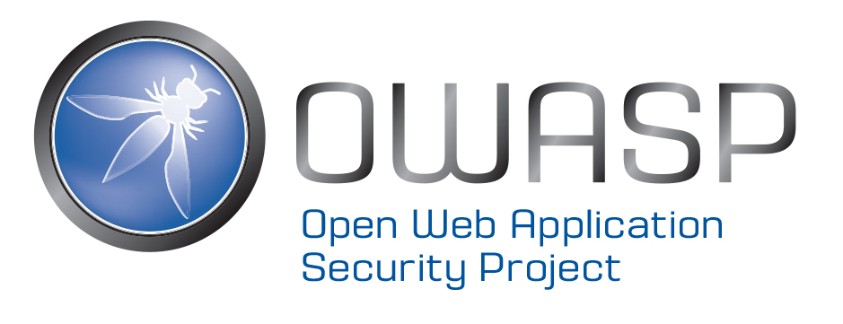

<section markdown="1">
# About AppSec USA 2018

Never been to an OWASP AppSec conference? Here’s a bit of info to provide some background.

What Happens at an AppSec USA Conference?

* Technical talks by experts in security, devops and cloud
* Panels to debate tough topics
* Training sessions for hands on learning in top security areas
* Keynotes from industry leaders
* Vendor booths to promote the latest advances in security technology
* A variety of other activities such as recruiting fair, capture the flag, security tool training, and more

</section>

<section markdown="1">

# Hosted by:

The Open Web Application Security Project (OWASP) is an open-source, not-for-profit application security organization made up of corporations, educational organizations, and individuals from around the world. Providing free, vendor-neutral, practical, cost-effective application security guidance, the OWASP Foundation is the de-facto standards body for web application security used by developers and organizations globally. Learn more about OWASP and membership benefits.

</section>